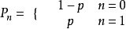
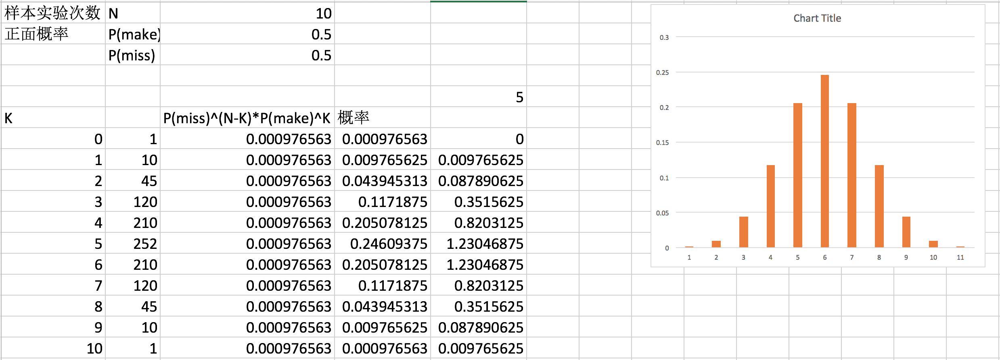
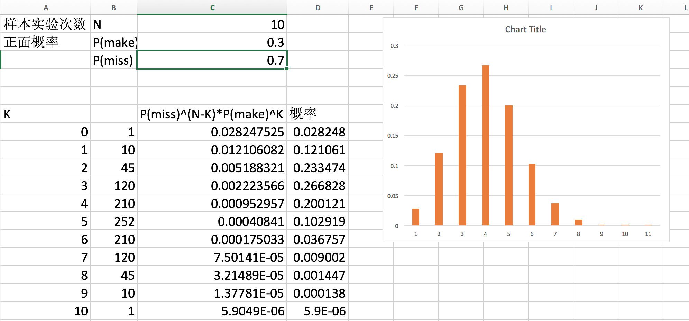
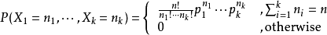
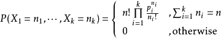
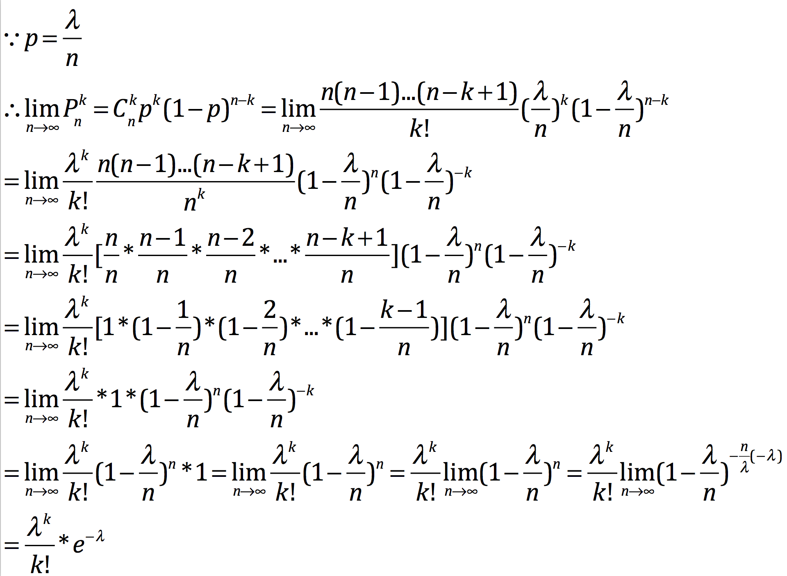

Python机器学习
=
#1. 算法分类
##1.1 第一种分类方法
有监督学习：有训练数据集。KNN、决策树、回归等等
无监督学习：没有训练数据集。聚类等等
半监督学习：强化学习。人学走路。

##1.2 第二种分类方法
###1.2.1 分类和回归
预测算法，最终生成一个模型。预测的变量是连续型数据变量，就是回归；如果是离散型的数据变量，那就是分类。
这里所说的变量，是表示类别的应变量，不是表示特征的因变量
- 回归算法：线性回归、广义线性回归
- 分类算法：逻辑回归、支持向量积、决策树

###1.2.2 聚类：

###1.2.3 关联分析：

###1.2.4 降维

#2. 概率基础
##2.1 先验概率
P(A)：事件A1,A2,...An看作是导致时间B发生的原因，在不知道事件B是否发生的情况下，它们的概率是P(A1),P(A2)...,P(An)，通常称为先验概率

##2.2 后验概率-条件概率
P(A|B)：如果B已经发生，那么对A1,A2,...An发生的可能性大小P(A1|B),P(A2|B),...,P(An|B)有了新的估价

##2.3 乘法公式
- 如果A、B是两个独立的事件(A的发生不会影响B的发生),那么就有P(AB) = P(A) * P(B)
- 如果A、B是两个不独立的事件(A的发生会影响B的发生),那么就有P(AB)=P(B|A)P(A)=P(A|B)P(B)

比如抽奖，一共有100个人，只有10个奖，那么抽完放回抽奖箱和抽完不放回抽奖箱，是完全不一样的，前者会导致独立事件的发生，后者则会导致非独立事件的发生，设
A：第一个人抽中奖，B：第二个人抽中奖，C：第三个人抽中奖
那么就有P(A) = 10/100 = 0.1。如果放回抽奖箱，那么P(B) = 10/100 = 0.1,如果不放回抽奖箱，那么P(B)的计算就不简单了，P(B)应该是P(B|A) + P(B|!A) = 19/99

那么P(AB)是多少呢，如果独立，那么A、B同时中奖的概率就是P(A) * P(B) = 0.1 * 0.1 = 0.01，如果不独立呢，P(AB) = P(A) * P(B|A) = 0.1 * 1/11

乘法公式的推广：

##2.4 加法公式

A、B两个事件互斥

##2.5 全概率公式

B和A不是一个级别的东西

##2.6 举例
已知三家工厂的市场占有率分别是30%、20%、50%，次品率分别是3%、3%、1%。如果买了一件商品，发现是次品，试求市场上该品牌的次品率
A为市场占有率
B为次品率
本例题求解的就是P(B)
根据题目得到以下概率：
P(A1) = 0.3
P(A2) = 0.2
P(A3) = 0.5
P(B|A1) = 0.03 ： 第一家工厂的次品率
P(B|A2) = 0.03 ： 第二家工厂的次品率
P(B|A3) = 0.01 ： 第三家工厂的次品率
那么
P(B) = P(A1)P(B|A1)+P(A2)P(B|A2)+P(A3)P(B|A3) = 0.3 * 0.03 + 0.2 * 0.03 + 0.5 * 0.01 = 0.09 + 0.06 + 0.05 = 0.2

#3 统计学基础
##3.1 概述
统计学主要分为：描述统计学，推论统计学

##3.2 基本概念
假设有如下数列 1，1，3，4，6，8，9，199
- 均数：也叫平均数，算数平均数，就是所有数字的和除以数字的个数，主要考察数列的集中趋势。均值为231/7 = 33
- 中位数：数列按照从小到大排序，然后获取中间的那个数字就是中位数，如果中间的是两个数字，那么中位数就是这两个数的平均数，主要也是考察数列的集中趋势,中位数为6
- 众数：数列中出现最多次数的数字，众数为1
- 极差：数列中最大的数减去最小的数。考察数列中的数的紧凑程度，极差为198
- 中程数：数列中最大数和最小数的平均值，主要考察数列的集中趋势，中程数为99
- 总体均值
- 总体方差
总体方差也可以用这个公式计算
所以上述队列的总体方差就是(2048+900+841+729+625+576+38416)/8=5516.875
- 样本均值
- 样本方差
样本方差使用n-1是为了保证无偏
- 标准差
- 期望：在概率论和统计学中，数学期望(mean)（或均值，亦简称期望）是试验中每次可能结果的概率乘以其结果的总和。是最基本的数学特征之一。它反映随机变量平均取值的大小。 其实就是n*p
- 随机变量的方差：
描述数列集中趋势可以使用均数、中位数、众数和中程数，但是这不能分好的反应数列中的数的发散程度。

#4. 常见概率分布
对于连续型变量，我们求概率密度函数，对于离散型变量，我门求概率分布律

##4.1 离散型分布之伯努利分布-Bernouli
伯努利分布是一种离散分布,有两种可能的结果。1表示成功，出现的概率为p(其中0<p<1)。0表示失败，出现的概率为q=1-p,最常见的例子就是只抛一次硬币的概率，就符合伯努利分布

该分布研究的是一种特殊的实验，这种实验只有两个结果要么成功要么失败，且每次实验是独立的并每次实验都有固定的成功概率p。
概率公式

期望就是

对于伯努利分布来说E(X^2)=E(X)，所以方差就是p(1-p)

##4.2 离散型分布之二项分布
二项分布就是重复n次的伯努利分布，典型的问题就是随机扔N次硬币，0次正面，1次正面，2次正面，3次正面，4次正面，5次正面...N次正面的概率，组成二项概率分布,可以知道n=1的时候，就是伯努利分布

假设有随机变量X，表示n次进行实验次数，其中每次成功的概率为P,那么n次中有K次成功的概率，就是

当正面的概率越小的时候，整个曲线会向左偏离，同理，如果正面的概率越大，就会向右偏离

期望就是np
方差np(1-p)

##4.2 离散型分布之多项式分布
对于二项式分布和伯努利分布来说，它们都只有两个结果，要么成功，要么失败；要么是好，要么是坏；如果结果有多个，那么就变成了多项式分布，比如扔骰子

或者

##4.3 离散型分布之泊松分布
当二项式分布中，n趋于无穷大的时候，二项分布就变成了泊松分布
泊松定理：设ℷ是一个正整数，p=ℷ/n,则有

证明：

其中ℷ=np，当n>=10,p<=0.1的时候，近似效果就很好了
期望值：ℷ，方差：ℷ

##4.4 连续型分布之正态分布-高斯分布
当ℷ变得很大时，泊松分布就可以近似成正态分布，一般在工作中，大于20就可以近似的用正态分布来解决

期望值：\mu, 方差\sigma^2

