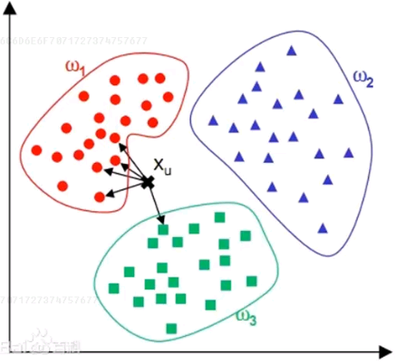
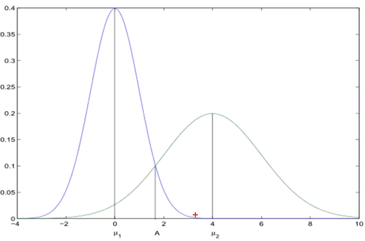

KNN算法-K Nearest Neighbor(分类算法)
=
#1 原理
数据映射到高维空间中的点、找出K个最近的样本、投票结果

距离与近似度

#2 如何衡量距离
数学中距离满足三个要求：必须是正数、必须对称、满足三角不等式

#3 常用的距离
##3.1 闵可夫斯基距离 Minkowski

q越大，差异越大的维度对最终距离影响越大
- 曼哈顿距离:q = 1，城市距离

- 欧氏距离：q = 2，直线距离

- 切比雪夫距离:q趋近于无穷大，棋盘距离

##3.2 马氏距离
考虑数据分布

#4 具体做法
计算出测试点与样本中的每个点的距离，找到一个导致最小距离的点，它的类别就是测试点的类别，这个距离的计算，一般使用欧氏距离