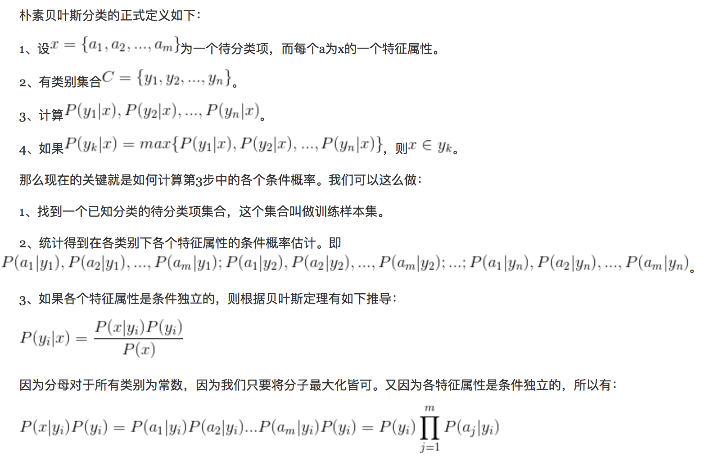
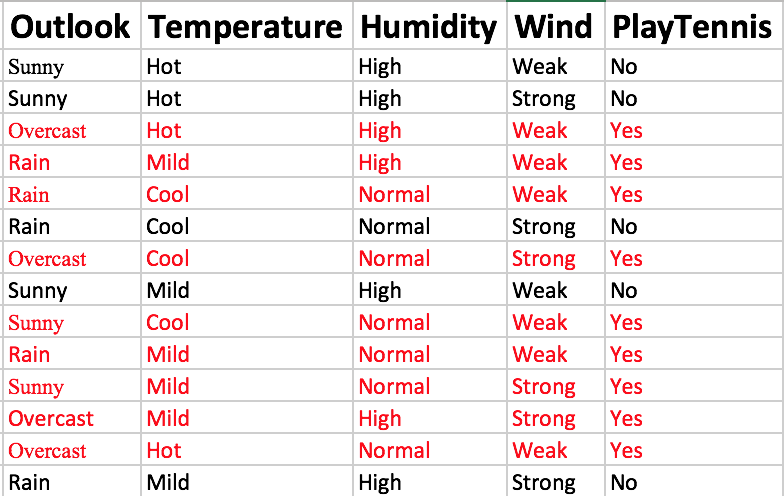
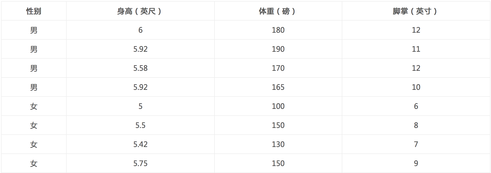

贝叶斯算法
=
#1 贝叶斯定理
与全概率公式解决的问题相反，贝叶斯公式是建立在条件概率的基础上寻找事件发生的原因
也就是已知P(B|A)，求解P(A|B)的问题

在观察到事件B已经发生的条件下，寻找导致B发生的每个原因A的概率


##1.1 贝叶斯分类器实例
已知三家工厂的市场占有率分别是30%、20%、50%，次品率分别是3%、3%、1%。如果买了一件商品，发现是次品，问它是甲、乙、丙厂生产的概率分别是多少？


所以这件商品最有可能是甲厂生产的
P(B) = 0.3 * 0.03 + 0.2 * 0.03 + 0.5 * 0.01 = 0.09 + 0.06 + 0.05 = 0.2，这个就是全概率，意思就是买到次品的概率

##1.2 应用场景
垃圾邮件过滤、新闻分类、金融风险识别

#2 全概率与贝叶斯公式
全概率公式可以看成是由原因推结果，而贝叶斯公式作用在于由结果推原因，所以贝叶斯公式也叫做逆概公式

#3 朴素贝叶斯 Naive Bayes
对于贝叶斯公式中的P(B)，其实它是一堆的指标，对于朴素贝叶斯来说，这些指标是相互独立的，互不影响


##3.1 多项式朴素贝叶斯
以出现次数作为特征，多项式朴素贝叶斯适用于特征是离散值的情况
给出最完整的定义：

怎么理解呢？看如下实例

特征就是Outlook,Temperature,Humidity,Wind这四个属性的值，所以m=4，其中x1=Outlook,x2=Temperature,x3=Humidity,x4=Wind，类别就是
PlayTennis,所以n=2，因为只有Yes和No两项。要求的就是如果Sunny, Cool, High, Strong，那么PlayTennis是yes，还是no，其实就是求的
PlayTennis是yes的概率大，还是no的概率大。那么我们实际要计算的其实就是：

P(y1|x),P(y2|x),一直到P(yn|x)这么多个概率中哪个概率最大，那么就应该是那个y值，具体到这个实例中，我们要求的其实就是
p(y1=Yes|x)和P(y2=No|x)那个大，

根据贝叶斯公式

根据朴素贝叶斯的定义，每个特征是相互独立的，那么上述表达式可以变成

分母是全概率，最后每个参与比较的概率包含这个分母，所以我们只需要比较分子就可以了。
```
P(a1|y1=Yes) = 2/9
P(a2|y1=Yes) = 1/3
P(a3|y1=Yes) = 1/3
P(a4|y1=Yes) = 1/3
P(y1) = 9/14
```
所以p(y1=Yes|x) = 9/14 * 2/9 * 1/3 * 1/3 * 1/3 = 0.00529
```
P(a1|y2=No) = 3/5
P(a2|y2=No) = 1/5
P(a3|y2=No) = 4/5
P(a4|y2=No) = 3/5
P(y2=No) = 5/14
```
所以p(y2=No|x) = 5/14 * 3/5 * 1/5 * 4/5 * 3/5 = 0.02057,所以no的概率大，那还是不去打网球吧

##3.2 伯努利朴素贝叶斯
与多项式模型一样，伯努利模型适用于离散特征的情况，所不同的是，伯努利模型中每个特征的取值只能是1和0(以文本分类为例，某个单词在文档中出现过，则其特征值为1，否则为0).
具体可以参考垃圾邮件的例子-GarbageEmailClassifier.py

##3.3 高斯朴素贝叶斯
当特征是连续变量的时候，运用多项式模型就会导致很多P(xi|yk)=0（不做平滑的情况下），此时即使做平滑，所得到的条件概率也难以描述真实情况。所以处理连续的特征变量，应该采用高斯模型。
高斯模型假设每一维特征都服从高斯分布（正态分布）

μyk,i表示类别为yk的样本中，第i维特征的均值。 
σ2yk,i表示类别为yk的样本中，第i维特征的方差。
解法举例说明：

已知某人身高6英尺、体重130磅，脚掌8英寸，请问该人是男是女？
按照类别求出每一个特征的均值和方差，带入高斯概率密度函数，可以求出每个特征的概率，然后所有特征的概率相乘，在乘以先验概率，最后比较大小
比如：
P(身高=6|男) x P(体重=130|男) x P(脚掌=8|男) x P(男) = 6.1984 x e-9
P(身高=6|女) x P(体重=130|女) x P(脚掌=8|女) x P(女) = 5.3778 x e-4

#4 注意
对于贝叶斯定理

来说，如果某个分量在训练集中没有出现过，会导致整个实例的概率计算结果为0，这显然是不合理的，不能因为一个事件没有观测到，就判断该事件的概率为0
- 加法平滑
样本缺少必要的值，不均衡，导致结果不正确
这就需要人为的造一些数据，使得样本均衡
一般我们需要在计算每个概率的时候，都要在分母上加上一个N*a这么一个数，0<a<1叫做 Lidstone平滑,如果a=1，那么就是拉普拉斯平滑，N是特征的维度，上述实例中就是N=4，
分子加上a,如果是拉普拉斯平滑，那么就是1
所以P(y1) = 9/14，就会变成(9+1)/(14+4 * 1),P(a1|y1=Yes) = 2/9就会变成(2+1)/(9 + 4 * 1)。。。以此类推，然后在比较，如果a2这个特征是0，那么就是(0+1)/(9 + 4 * 1)

- 对数加法

#7 裤子与裙子
假设一个学校里有60%男生和40%女生。女生穿裤子的人数和穿裙子的人数相等，所有男生穿裤子。一个人在远处随机看到了一个穿裤子的学生。那么这个学生是女生的概率是多少？
假设A1：看到女生，A2:看到男生，B：看到穿裤子的学生，那么我们要求的就是P(A1|B)
根据题目有如下结果
看到女生的概率：P(A1) = 40% 
看到男生的概率P(A2) = 60%
这两个是先验概率
看到女生穿裤子的概率：P(B|A1) = 50%
看到男生穿裤子的概率：P(B|A2) = 100%
这两个是后验概率
看到穿裤子的学生的概率：P(B) = P(A1)P(B|A1) + P(A2)P(B|A2) = 40% * 50% + 60% * 100% = 0.2 + 0.6 = 0.8
这个就是全概率
看到一个穿裤子的女生的概率

这个就是贝叶斯概率公式
结果就是50% * 40% / 80% = 0.2 / 0.8 = 0.25