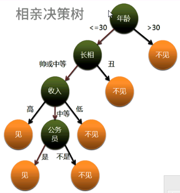
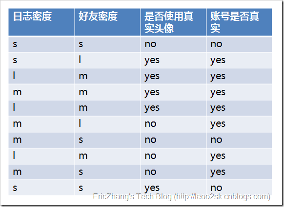
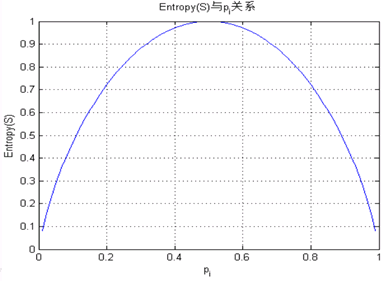
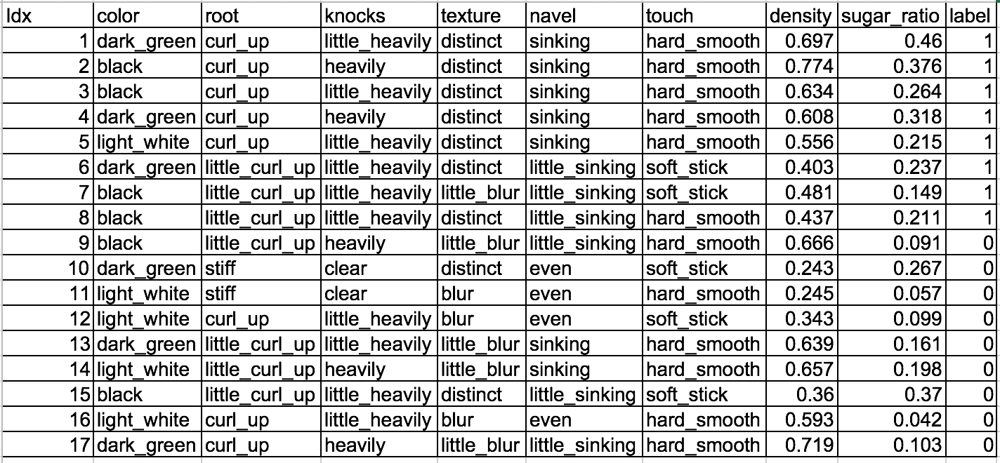
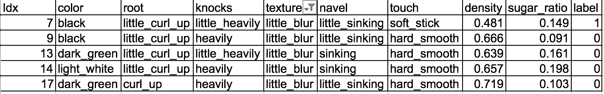
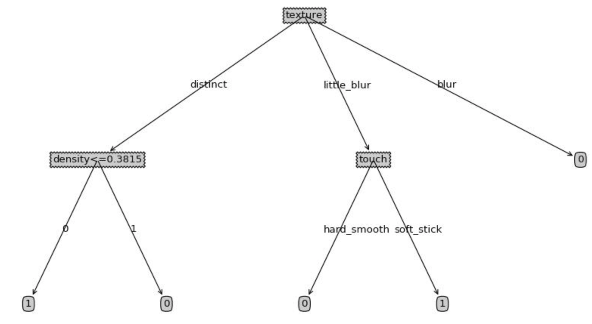

决策树算法
=
分类算法，包括ID3、C4.5、C5.0和CART四种算法，前三种属于一种方法的不同改进版本（机器学习的人研究出来的）
CART：分类回归树（统计学派研究出来的算法，即可以分类，也可以回归）
四个算法几乎完全一样，只不过是两种不同的流派
元模型：Bagging、Boosting、随机森林
分类算法是强算法，以算法取胜，元模型以量取胜；

决策树是一个线性分类器，是对样本数据不断分组的过程

#1 术语

根节点：一颗决策树只有一个根节点
叶节点：代表一个类别
中间结点：代表在一个属性上的测试
分支：代表一个测试输出

CART算法得到的是二叉树，ID3得到的是多叉树

不断的构造根节点的过程

#2 基本概念

其中s、m和l分别表示小、中和大

##2.1 熵与基尼系数
熵
p(Xi)表示第i个类别在整个训练元组中出现的概率

针对上面的例子，帐号真实的记录有7条，那么P(X) = 0.7， 帐号不真实的概率就是0.3
帐号是否真是的熵就是0.7 * log2(0.7) + 0.3 * log2(0.3) = 0.879
如果有三个类别，那么就是三个类别中，每个类别的概率乘以以2为底的这个类别的概率的对数，然后相加

基尼系数

熵是一个期望，越不确定，熵越大.事件的结果发生的概率越小，信息量越大


##2.2 条件熵

举例，问今天的下雨概率是多少，如果对这个地方不熟悉，那么概率各50%，这个时候熵是最大的。接下来告诉你这个地方现在是雨季，而且昨天下过雨，天气比较阴，
那么这个时候下雨的概率就会更大，比如80%，那么熵会变小

根据日志密度来分类，可以分为下面三组数据
```
S S N N
S L Y Y
S S Y N
```
```
L M Y Y
L M Y Y
L M N Y
```
```
M M Y Y
M L N Y
M S N N
M S N Y
```
针对上面的例子，日志密度的条件熵就是，对于日志是S的第一组记录，他有三条记录，所以日志密度的概率就是3/10 = 0.3,那么P(帐号真实 | 日志密度)的概率就是1/3
所以对于第一组数据得出结果就是日志密度为S的条件熵为0.3 * ((2/3) * log2(2/3) + (1/3) * log2(1/3))
对于日志是L的第二组记录，它的条件熵就是0.3 * ((0/3) * log2(0/3) + (3/3) * log2(3/3))
对于日志是M的第三组记录，它的条件熵就是0.4 * ((1/4) * log2(1/4) + (3/4) * log2(3/4))
所以，日志密度的条件熵就是三个数相加，结果就是0.603

##2.3 信息增益（互信息）
在知道了事件Y之后，X事件不确定性减少程度
Gain=熵-条件熵

针对上述例子，日志密度的信息增益就是0.276
同样的办法得到好友密度和是否使用真实头像的信息增益分别是0.033和0.553

##2.4 信息增益率
信息增益率=信息增益/熵

ID3选择信息增益最大的属性作为决策属性

#3 树的构造
##3.1 选取变量的数序
选择变量的顺序，也就是选择决策属性的问题

##3.2 最佳分离点（边界值）

##3.3 树的修剪
避免出现过拟合，过拟合表示跟当前的样本拟合的很好，但是用在别的样本上，完全不能用，不能一般化的结果

##3.4 具体算法
- ID3：信息增益、没有修剪、处理离散特征,基于奥卡姆剃刀原理,(Iterative Dichotomiser 3，迭代二叉树3代)
- C4.5：信息增益率、悲观剪枝法、处理离散和连续特征--主流算法
- C5.0：信息增益率、自适应增强
- CART：基尼指数、代价复杂度剪枝法，处理离散和连续特征--主流算法

#4 算法举例

##4.1 计算熵
总共有17条记录，类别为1的有8条，类别为0的有9条，所以
P(label=1) = 8/17 = 0.470588235
P(label=0) = 9/17 = 0.529411765
H(label)=-(0.470588235 * LOG(0.470588235, 2) + 0.529411765 * LOG(0.529411765, 2)) = 0.997502546

##4.2 计算每个特征的条件熵以及信息增益
###4.2.1 离散性变量
color,root,knocks,texture,navel,touch这六个特征是离散型的

####4.2.1.1 color特征
包含三个值：dark_green、black、light_white
其中数据集中包含dark_green的记录有6条，
所以P(color=dark_green)=6/17
这6条中，类别为1的有3条，类别为0的有3条，所以
P(label=1|color=dark_green) = 3/6 = 0.5
P(label=0|color=dark_green) = 3/6 = 0.5
H(color=dark_green) = -(0.5 * LOG(0.5, 2) + 0.5 * LOG(0.5, 2)) * (6/17) = 0.352941176

其中数据集中包含black的记录有6条，
所以P(color=black)=6/17
这6条中，类别为1的有4条，类别为0的有2条，所以
P(label=1|color=black) = 4/6 = 0.666666667
P(label=0|color=black) = 2/6 = 0.333333333
H(color=black) = -(0.666666667 * LOG(0.666666667, 2) + 0.333333333 * LOG(0.333333333, 2)) * (6/17) = 0.324104412

其中数据集中包含light_white的记录有5条，
所以P(color=light_white)=5/17
这6条中，类别为1的有1条，类别为0的有4条，所以
P(label=1|color=light_white) = 1/5 = 0.2
P(label=0|color=light_white) = 4/5 = 0.8
H(color=light_white) = -(0.2 * LOG(0.2, 2) + 0.8 * LOG(0.8, 2)) * (5/17) = 0.212331793

所以H(label=color) = 0.352941176 + 0.324104412 + 0.212331793 = 0.889377381
信息增益 = 0.997502546 - 0.889377381 = 0.108125165

####4.2.1.2 root
root也有三个值curl_up、little_curl_up、stiff
根据上面的算法，得到如下结果
H(root=curl_up)=0.449145413
H(root=little_curl_up) = 0.405682174
H(root=stiff) = 0

所以H(label=root) = 0.449145413 + 0.405682174 + 0 = 0.854827587
信息增益 = 0.997502546 - 0.854827587 = 0.14267496

####4.2.1.3 其它离散变量的条件熵和信息增益
H(knocks) = 0.571147409 + 0.285573704 + 0 = 0.856721113
信息增益 = 0.997502546 - 0.856721113 = 0.140781434

H(texture) = 0.404578856 + 0.212331793 + 0 = 0.616910649
信息增益 = 0.997502546 - 0.616910649 = 0.380591897

H(navel) = 0.355402587 + 0.352941176 + 0 = 0.708343764
信息增益 = 0.997502546 - 0.708343764 = 0.289158783

H(touch) = 0.705882353 + 0.285573704 + 0 = 0.991456057
信息增益 = 0.997502546 - 0.991456057 = 0.006046489

###4.2.2 连续型变量
density和sugar_ratio是连续型变量

####4.2.2.1 density变量
首先将样本中的density列的数据排序:
0.243,0.245,0.343,0.36,0.403,0.437,0.481,0.556,0.593,0.608,0.634,0.639,0.657,0.666,0.697,0.719,0.774
然后相邻两数求中间数：
0.244,0.294,0.3515,0.3815,0.42,0.459,0.5185,0.5745,0.6005,0.621,0.6365,0.648,0.6615,0.6815,0.708,0.7465
得到16个数字，然后循环这16个数字，做下面的操作
- 将样本根据density与当前中间数的大小，将样本分为两部分，比如样本一的density=0.697, 比当前中间数0.244大，那么这条记录归入第一个部分，
第二条样本的density=0.774,也比0.244大，也归入第一部分，以此类推，发现只有第10个样本的density=0.243小余0.244，那么它单独归入第二个部分，
这样，第一个部分包含16条记录，第二个部分包含1条记录（记录10）
- 然后这两个部分分别求熵，然后求和，这个就是当前数字0.244的条件熵=0.941176471
- 接着处理第二个数字0.294,方法跟上面一样，最后得到一个列表
0.941176471，0.8795220282190911，0.8113643473223249，0.7350632859645522，0.9040038561323909，0.9673004312102036，0.9939174677788095
0.9952755610908235，0.9952755610908235，0.9939174677788095,0.9673004312102036,0.9914560571925497,0.9967327574767078,
0.9734165533319407,0.9971690870426205,0.9305406195656446
那么最小值就是0.7350632859645522，这个就是density的条件熵
信息增益=0.997502546 - 0.7350632859645522 = 0.2624392604045631

####4.2.2.3 sugar_ratio
信息增益= 0.349293722

综上所述，取每个特征中信息增益最大的，那么就是texture特征，它也就是根节点，它包含三个值distinct、little_blur、blur
所以这个树有三个分支

##4.3 递归
###4.3.1 选择blur分支
我们发现如果texture=blur的时候，label都是0，所以这个分支不需要递归，它的叶子节点就是0

###4.3.2 选择distinct分支
texture=little_blur的时候，数据集变为下面的情况

用这个数据集作为样本，代入步骤2，进行计算条件熵和信息增益
信息增益分别为(去掉了texture这个特征)
0.043068396， 0.458105895, 0.330856225, 0.458105895, 0.458105895, 0.764204507, 0.22478751,
可以看到density这个特征的信息增益最大，所以little_blur的子节点就是density，但是它是一个连续变量.我们知道，连续变量离散化的时候，首先
需要排序，然后求两两的平均数，得到如下列表
0.3015，0.3815，0.42，0.4965，0.582，0.621，0.6655，0.7355
会求出每个值的相关熵，最小的就是0.3185对应的熵，所以我们会用0.3815来作为分割点,<=0.3185的是一个分支，大于的是另一个分支,可以看到<=0.3815的只有第10,15两
条记录，且它们的label都是0,大于0.3815的label都是1，所以这个节点下面不需要在递归，一个叶子是0，一个叶子是1

###4.3.3 选择little_blur分支
同样的，计算结果是它的下面是touch特征，touch下面有分成两个分支，一个0，一个1

所以最后的树就是如下：


##4.4 决策树停止生长的条件
1. 该群数据的每一笔数据已经归类到每一类数据中，即数据已经不能继续在分。
2. 该群数据已经找不到新的属性进行节点分割
3. 该群数据没有任何未处理的数据

##4.5 剪枝
###4.5.1 理想的决策树
1. 叶子节点数最少
2. 叶子加点深度最小
3. 叶子节点数最少且叶子节点深度最小

###4.5.2 剪枝的原因-过度拟合问题
过度拟合表示，生成的决策树对于本实例匹配的很好，但是由于过度拟合于这个样本，那么对于其它过来的样本，拟合的特别不好，所以我们就说这个决策树过度
拟合于当前样本
造成多度拟合的潜在原因主要以下两个方面
1. 噪声导致的过度拟合
2. 缺乏代表性样本所导致的过度拟合

所以我们就需要减去一些分支来消除过拟合问题

###4.5.3 剪枝的办法
####4.5.3.1 预剪枝
通过提前停止树的构建而对树剪枝，一旦停止，节点就是树叶，该树叶持有子集元祖最频繁的类。停止决策树生长最简单的方法有：
- 定义一个高度，当决策树达到该高度时就停止决策树的生长
- 达到某个节点的实例具有相同的特征向量，及时这些实例不属于同一类，也可以停止决策树的生长。这个方法对于处理数据的数据冲突问题比较有效。
- 定义一个阈值，当达到某个节点的实例个数小于阈值时就可以停止决策树的生长
- 定义一个阈值，通过计算每次扩张对系统性能的增益，并比较增益值与该阈值大小来决定是否停止决策树的生长。

####4.5.3.2 后剪枝
它首先构造完整的决策树，允许树过度拟合训练数据，然后对那些置信度不够的结点子树用叶子结点来代替，该叶子的类标号用该结点子树中最频繁的类标记。相比于先剪枝，这种方法更常用，正是因为在先剪枝方法中精确地估计何时停止树增长很困难。

- REP-错误率降低剪枝
思想：一部分数据用来学习，一部分数据用来测试，它需要对每个节点进行测试，决定该节点是否应该被剪枝：
1：删除以此结点为根的子树
2：使其成为叶子结点
3：赋予该结点关联的训练数据的最常见分类
4：当修剪后的树对于验证集合的性能不会比原来的树差时，才真正删除该结点

- PEP-悲观错误剪枝 C4.5算法
思想：根据剪枝前后的错误率来判定子树的修剪,该方法引入了统计学上连续修正的概念弥补REP中的缺陷，在评价子树的训练错误公式中添加了一个常数，假定每个叶子结点都自动对实例的某个部分进行错误的分类

- CCP-代价复杂度剪枝 CART算法