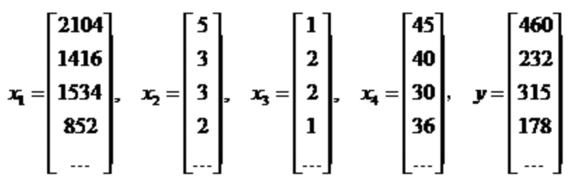

线性回归
=
线性回归：用来对于连续性变量进行预测的办法
梯度下降：用来寻找最优解的方法，非常重要

下面所说的连续型和离散型是针对结果应变量来说的，而不是针对自变量来说的
#1 连续型-应变量(y)
回归算法-线性回归、广义线性回归、CART

#2 离散型-应变量(y)
分类算法-逻辑回归、SVM、决策树、CART、KNN、朴素贝叶斯等等

#3 线性回归
不独立的两个随机变量，二者之间肯定会存在某种关系：
> - 确定性关系：函数关系
- 不确定性关系：线性关系、非线性关系

相关关系不是因果关系，不相关表示没有**线性**关系，独立表示没有任何关系

#4 协方差和相关系数
##4.1 期望

##4.2 协方差
Cov

##4.3 相关系数
Cor
取值范围[-1,+1]

#5 线性回归的解法
解决线性回归的办法主要有最小二乘法和梯度下降法。
最小二乘法可以计算出解析解，但是计算量很大，如果特征超过10000，那么效率会很低，因为涉及到矩阵的计算；梯度下降法可以求出数值解，适合于大数据量
的求解

##5.1 数值优化
-解析解:精确解
-数值解：差不多的解，导致损失函数最小的那个解

在机器学习中，只有线性回归能得到解析解

##5.2 线性回归的损失函数

我们需要使得L最小，其中x，y已知，需要求解h,其中

我们上面只是考虑的一个特征的情况，最终我们需要求解\Theta_1和\Theta_2，使得损失函数最小

带入后，得到上述方程，那么画出曲线之后，会是一个开口向上的抛物面

每个样本距离线性回归曲线的误差，是独立并且具有相同的分布，通常认为服从均值为0方差为\Theta^2的高斯分布
##5.3 最小二乘法

##5.4 梯度下降法
梯度方向是函数值变化最快的方向
全微分：考虑所有自变量变化时，函数值的变化情况
偏微分：假设其它自变量不变，考虑一个变量变化，函数值的变化情况

梯度向量:所有变量偏微分组成的向量。
梯度方向由L(θ)对θ的偏导数确定,所以我们需要沿着负梯度方向往下走

梯度下降法的思路就是找到负梯度方向，然后不停的以一个很小的间隔去向它移动，直到前后两次的高度差小于一定范围的时候，停止，这个时候可以求出m和b
这就涉及到一个问题，这个很小的间隔怎么选取，我们管这个参数叫做\alpha，一般定义为0.001，这个参数太大了，会在底部不停震荡，如果太小，那么迭代次数
太多

##5.5 多变量线性回归 - 多重线性回归
###5.5.1 梯度下降法的一般形式
假设有n个特征，表达式如下

那么

这是什么意思，首先给θ0,θ1,...θn设置初始值，基本都是1，然后中间部分一样，这个值就是用这些初始值带入m个向量，可以得到m个值，用这m个值分别减去它们
对应的y值，然后用这个值分别乘以对应记录的当前向量特征的值(θ0就是X0，X0没有，就是1，θ1就是当前记录的第一个特征的值)然后将这m个值求和,然后乘以步长，
乘以1/m,这个值我们可以叫他delta。对于θ0来说，他的下一个值就是θ0-delta，对于θ1来说，他的下一个值就是θ1-delta...
直到前后两次的高度差小于一定范围

###5.5.2 标准方程的一般形式

x1 : 房子大小, x2 : 卧室数量, x3 : 楼层数量, x4 : 房龄, y : 房子的价格，则有：

这时，使用线性代数表示更为方便。我们假设，x0=1

由线性代数运算，可得：

也就是X的转置乘以X，然后取逆矩阵，在乘以X的转置，在乘以y
但是有个问题，如果X的转置乘以X，不能求逆矩阵怎么办，也就是说它不是一个正矩阵(行列相等)怎么办？
- 导致无法求逆矩阵的情况有两个
    - 变量之间存在线性关系
    - 变量数量大于记录数

解决这个问题，需要依靠岭回归、Lasso回归或者弹性网来解决