支持向量机-SMO算法
=
#1. 概述
支持向量机的三种情况：线性可分、近似线性可分、非线性可分，可以做二分类，也可以做多分类
线性可分：在空间中可以找到一条直线，或一个平面，或一个超平面，把样本可以完美的分开，一类在一边，另一类在另一边，也就是θX + b
近似线性可分：在空间中可以找到一条直线，或一个平面，或一个超平面，把样本可以近似的分开
非线性可分：在空间中可以找到一条曲线，或一个曲面，把样本可以完美的分开

逻辑回归是不能进行非线性可分的

#2. 重要概念
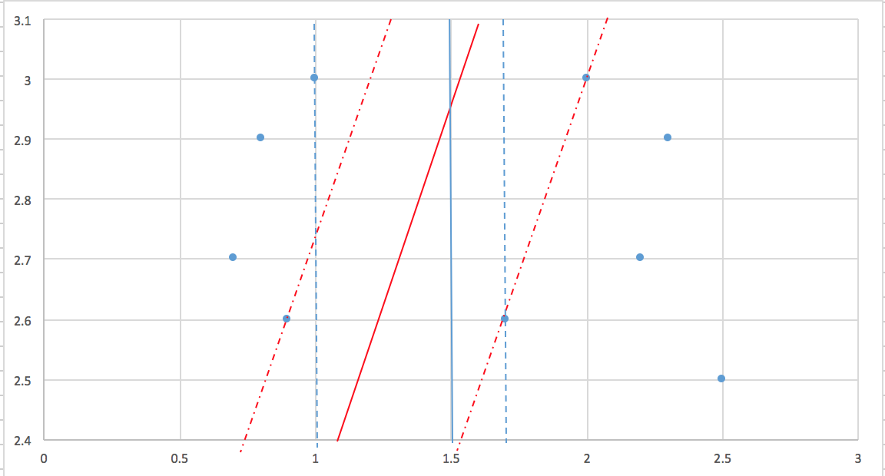
如上图所示，在空间中存在9个点，我们可以找到很多的平面来把它们完美的分为两组，比如中间的两个实线所在的平面，这两个面可以向左右进行平移，
当与某个点相交后，可以形成两个不同的虚面，(蓝色的形成两个虚面，红色的形成两个虚面)，那么蓝色的两个虚面的距离和，就叫做D，同样两个红色
虚面的距离和，也叫做D，那么使得D最大的分割面，就是最好的分割面,虚面叫做支撑平面，跟支撑平面相交的点，就叫做支撑向量,D叫做间隔
分割面的公式如下：

两个支撑平面的公式如下


w是平面的法向量(垂直于平面的向量)，-1和+1是分类标签(逻辑回归的分类标签是0和1)
假设x'是支撑平面上的一点，那么支撑平面到分割平面的距离，就是这个点x'到分割平面的距离，那么就是
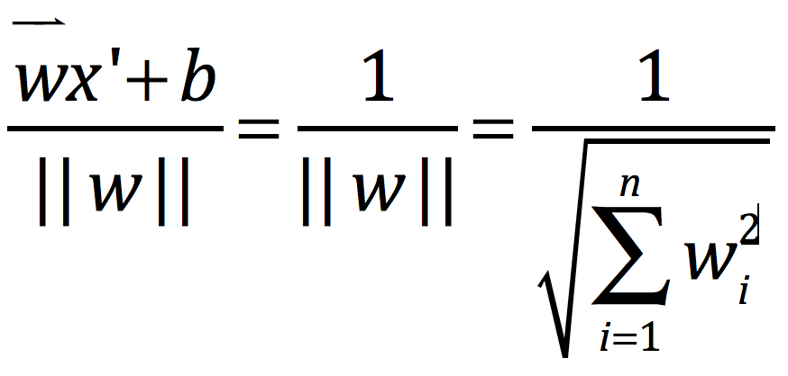
那么D=2/||w||，也就是2除以w的模长(w的模长就是w的长度)但是这里有个约束条件，那么就是样本点带入wx+b的公式中，要么结果是<=-1的，要么就
是>=1的，总结一下就有如下约束
=1" style="border:none;">

x就是样本点的坐标，等于1的时候，样本点正好落在支撑平面上,所以我们需要求解的问题，就变成了
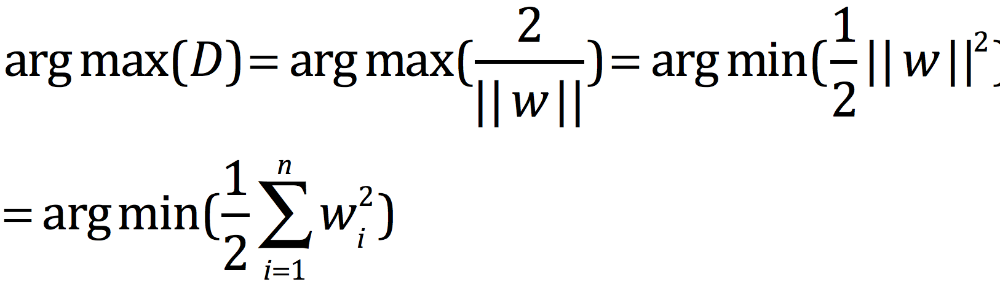

#3. 解法
##3.1 拉格朗日乘子法
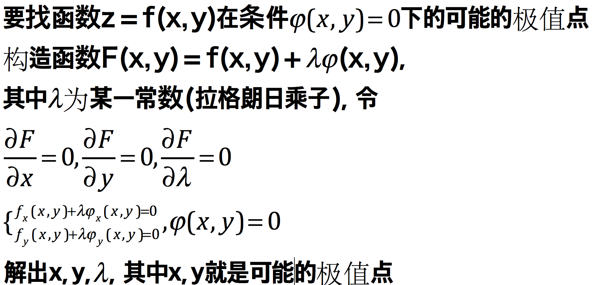
举例说明
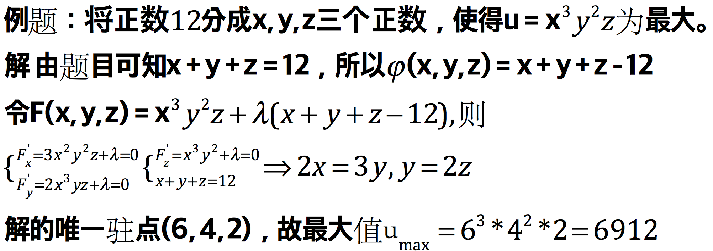

##3.2 广义拉格朗日乘子法
###3.2.1 极值问题的一般形式
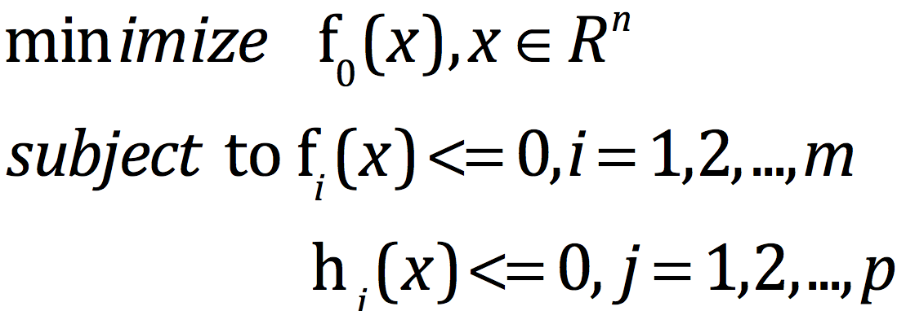
约束条件既可以<=0，也可以=0, 比如f(x)>17,我们可以转化为17-f(x)<0

###3.2.2 广义的拉格朗日函数   
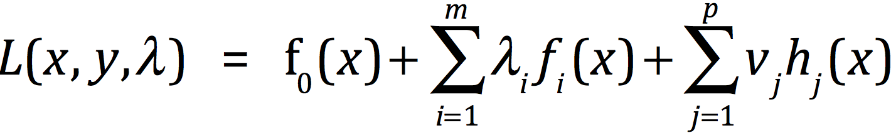
也就是说不等值的条件有m个，等值的条件有p个，我们可以给每个条件都加上一个参数，然后把它们都加在一起
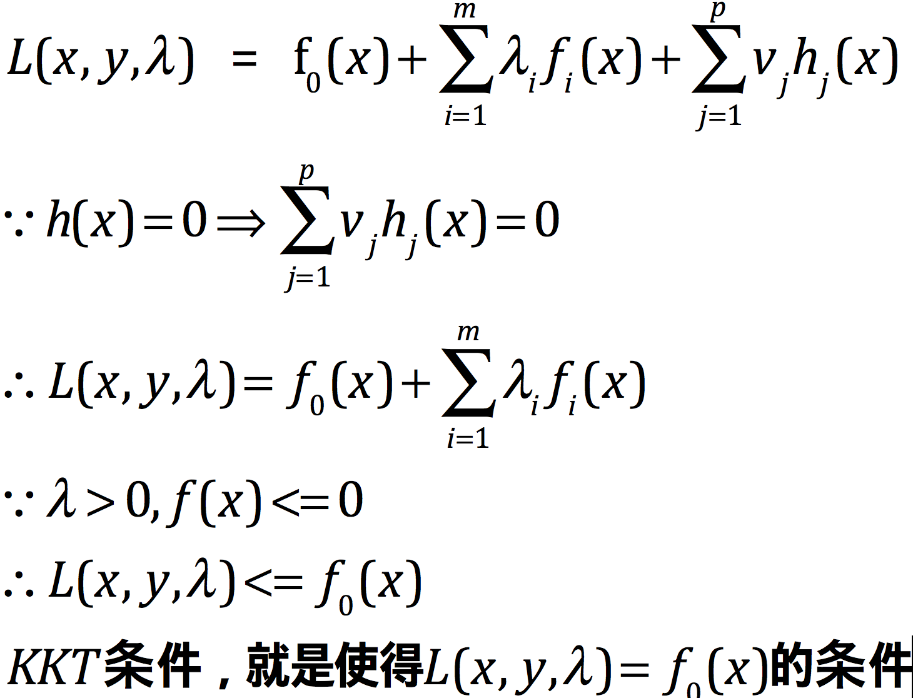

##3.3 拉格朗日函数
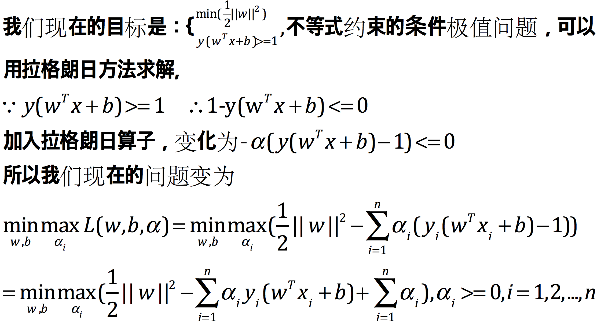
这是一个凸规划问题，其意义是先对α求偏导，令其等于0消掉α，然后再对w和b求L的最小值。要直接求解（5）式是有难度的，通过消去拉格朗日系数来化简
方程，对我们的问题无济于事。所幸这个问题可以通过拉格朗日对偶问题来解决，为此我们把（5）式做一个等价变换：
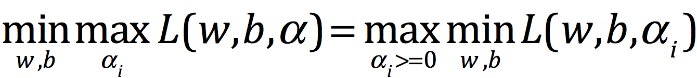
其意义是：原凸规划问题可以转化为先对w和b求偏导，令其等于0消掉w和b，然后再对α求L的最大值。下面我们就来求解（6）式，为此我们先计算w和b的偏
导数。


##3.4 拉格朗日对偶函数
由于我们对于w,b求了偏导数，所以有
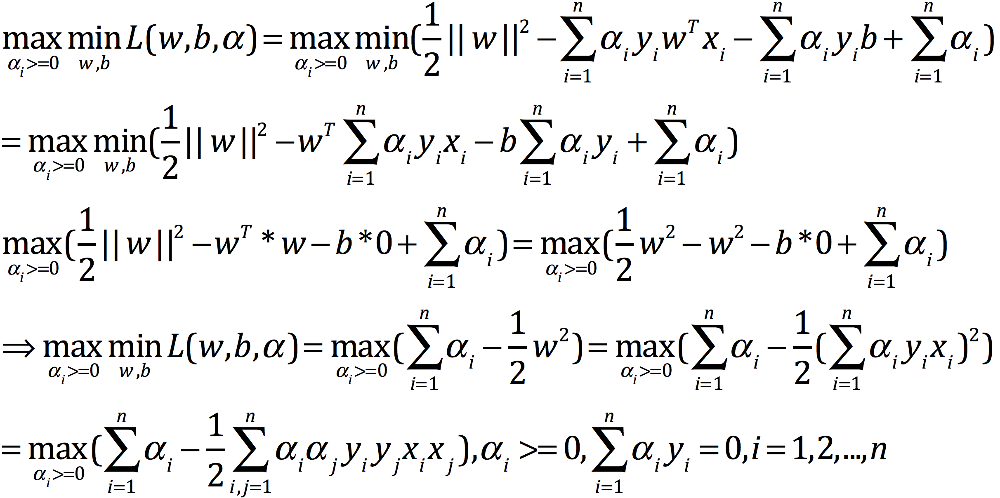

##3.5 求解
根据上面的条件，其实还有一个等式成立：
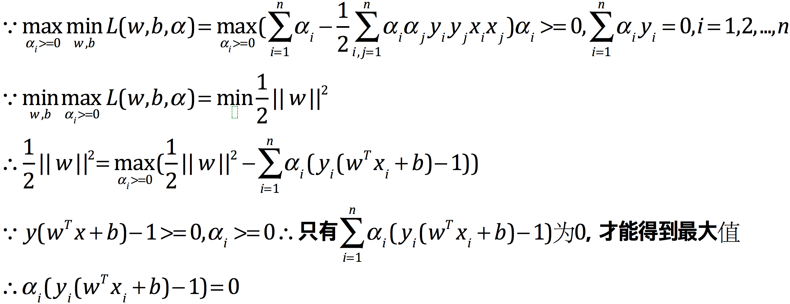
所以到目前位置，我们能得到下面三个式子：
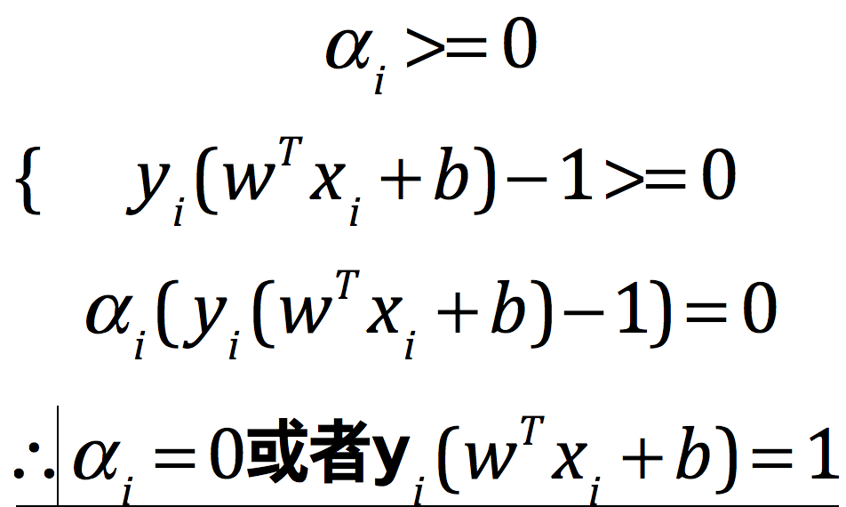


所以如果一个样本是支持向量，则其对应的拉格朗日系数非零；如果一个样本不是支持向量，则其对应的拉格朗日系数一定为0。由此可知大多数拉格朗日系
数都是0

#4. 近似线性回归
##4.1 概述
间隔代表着向量机的健壮性，完美分离的平面未必最好(间隔不够大，那么就不够健壮)，并且有时候有些数据是非线性可分的，所以这个时候我们就会
找到一个平面，只要近似可分就可以了。
硬间隔：完美分割所有数据样本的间隔，就是硬间隔
软间隔：有部分数据样本分错的间隔，就是软间隔

##4.2 松弛变量与惩罚因子
松弛变量代表着分错的样本(分到两个支撑平面里面的样本)距离最近的支撑平面的距离
C代表对分错的数据点的惩罚，C越大，惩罚越重，分错的数据点就越少，容易过拟合；C越小，惩罚越小，分错的数据点越多，精度下降，C趋近于无穷大
的时候，就等价于硬间隔。C越小，支撑平面间隔就越大，反之，就会越小

##4.3 目标函数与约束条件
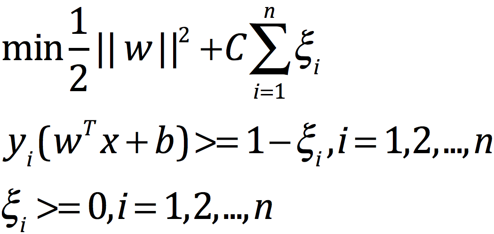
也就是说，虽然可以允许一部分样本分错，但是不能离支撑平面太远，跟逻辑回归类似
对此函数求导，跟线性可分的求导结果一样，对偶函数的结果也一样

##4.4 硬间隔与软间隔的求解方程
对于线性可分的硬间隔，我们之前就找到了，如下：
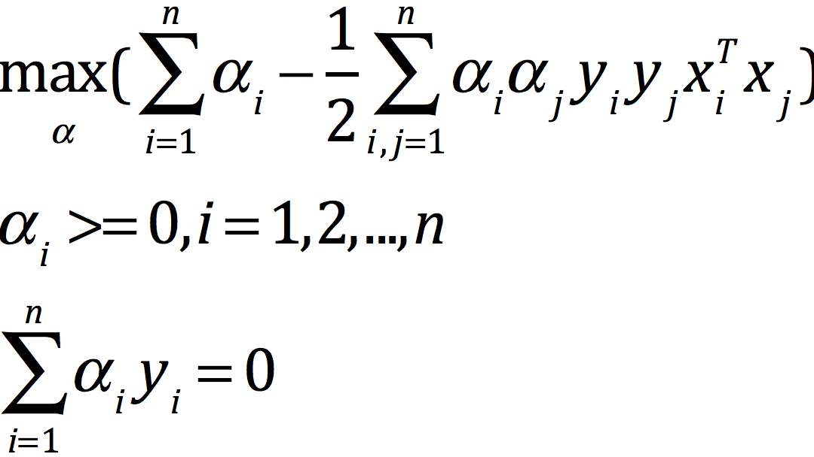
根据广义拉格朗日函数，得到近似线性可分的软间隔公式，如下：
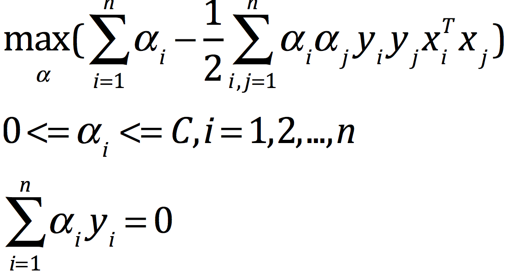
发现只有a的取值范围不同，剩下的都一致
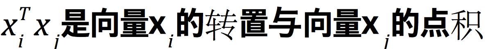

#5. 非线性可分与核函数
##5.1 引入
思路：对于在二维空间中的非线性可分，我们可以引入一个第三维，将二维空间扩展到三维空间，从而将低维度的非线性可分，转化为高维度的线性可分，
因为在三维空间中的Z轴上，会有一个平面可以进行线性可分的，现在就有两个问题：
- 在不知道数据规律的情况下，如果确定该映射到几维空间？
- 新空间坐标如何根据现有维度来确定？

根据非线性可分的求解方程，我们知道如果映射到高维空间，只有X的部分会发生变化，因为映射到高维空间，数据样本会发生变化，点积也必然会发生变化，
这个时候的点积是高维空间的点积，所以如果我们能够这个点积的结果，那么就可以不用思考上面的两个问题了，这个时候，进引入了核函数

##5.2 核函数
将低维空间的变量，带入一个函数，可以得到映射到高维空间后的点积，这个函数就是核函数
核函数只是一种运算技巧，用来计算映射到高维空间之后的点积的一种简便方法，实际中我们根本就不知道映射到底是什么形式的。

###5.2.1 常见核函数
高斯核(径向基核，RBF)：高斯核可以映射到无穷维
指数核
多项式核

##5.3 引入核函数前后的做法
之前，我们的做法就是通过求解w和b，然后带入wx+b，如果结果>1，就是一个分类，如果<-1，那就是另外一个分类
那么引入核函数之后，w和x就不是样本原始空间中的w和x了，而是高维度的w和x，那么
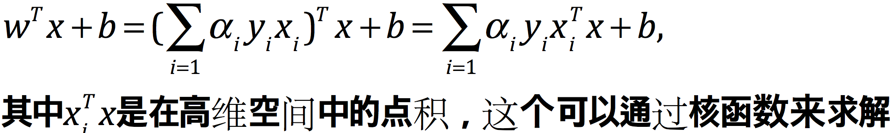
 
#6. SMO算法
##6.1 求解目标
无论，我们是线性可分、近似线性可分或者是分线性可分，都可以通过加入松弛变量，或者是核函数，来映射成求
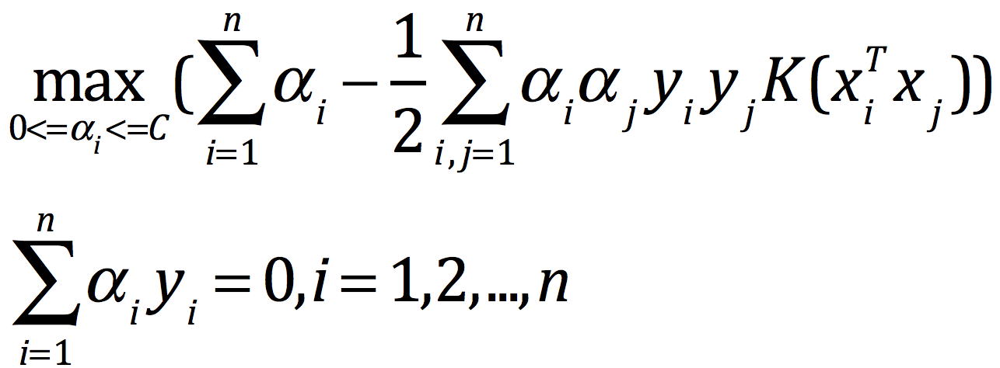
要解决的是在参数{a1,a2,...,an}上求最大值W的问题，至于xi和yi都是已知数。C由我们预先设定，也是已知数.

##6.2 固定一个参数带来的问题
如果我们固定除a1之外的所有参数，然后在a1上求极值，会有问题。因为如果别的参数固定了，那么a1也就固定了，这是因为有一个条件约束
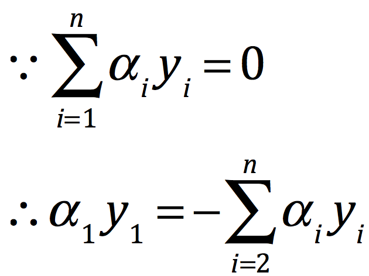
所以这个思路有问题，所以我们一次只能最少选择两个参数做优化。

##6.3 伪代码
```
重复下面的过程知道收敛{
    选择两个拉格朗日乘子ai和aj;
    固定其它拉格朗日乘子，只对ai和aj进行优化，会得到一个a的向量w(a);
    根据优化后的ai和aj，更新截距b的值
}
```
迭代的停止条件是ai和aj基本没有改变，或者总得迭代次数达到了迭代次数上限
 
##6.4 选择ai和aj
主要是根据KKT条件来选择，需要选择那些违反KKT条件的ai和aj选择出来,我们根据KKT条件，可以得出以下结论：
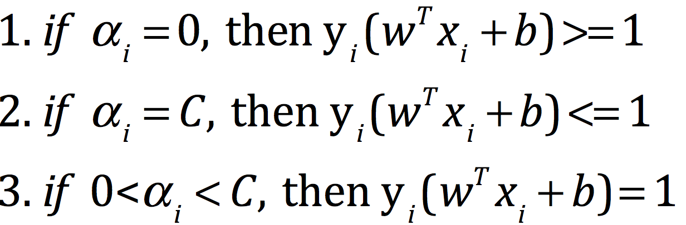

两个支撑平面外的点，符合要求1；对于支撑平面之间的点，符合要求2；对于落在支撑平面上的点，符合要求3；
如果我们的样本不满足上面的三个条件，那么就是违反了KKT的条件,一般情况下，我们会根据是否违反KKT条件来选择ai，那么aj的选择就是随机选择一个

##6.5 优化
既然选择了ai和aj，固定了其它的a，那么我们的对偶函数就变成了一个关于ai和aj的二元二次方程，具体推导如下：
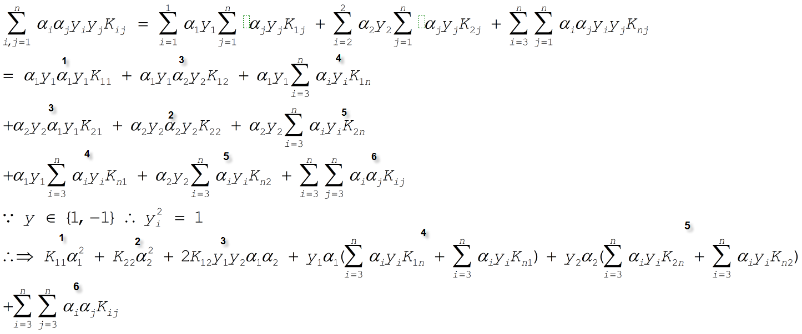
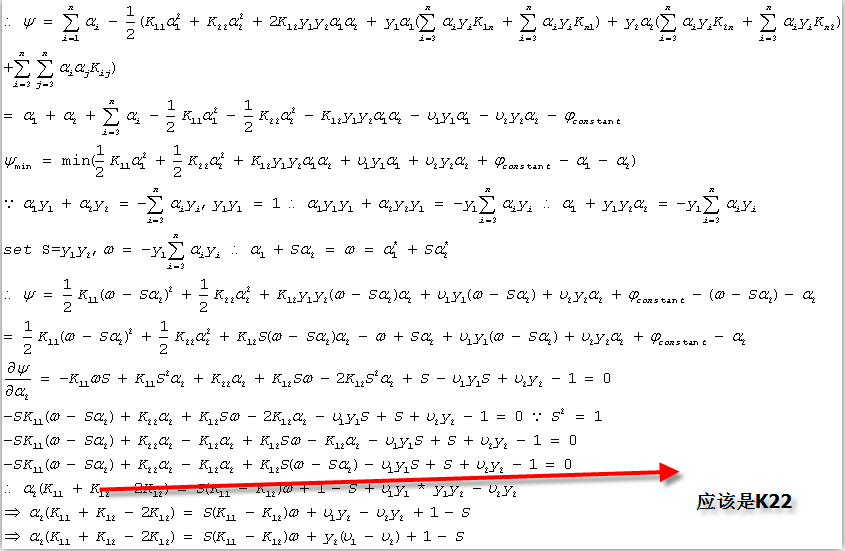
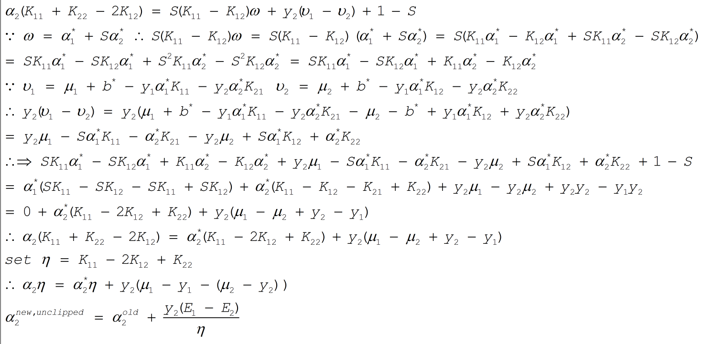
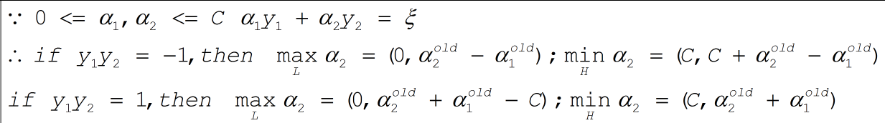

##6.6 具体做法

#7 多分类问题


